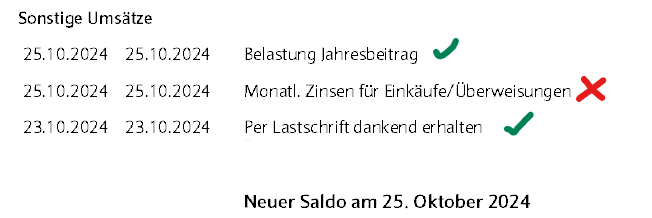

# Barclays Bank Germany
Barclays Bank Germany does not provide a CSV export option, but you can download the transactions in MS Excel format.

**Attention:** Not all transactions are displayed in online banking and accordingly they are not included in the Excel sheet! The **monthly interest for purchases/transfers are missing** (and maybe more). You have to check your bank statement (the pdf document you can download) and add the missing entries. It seems that all fees such as the annual fee or fees for foreign assignments are displayed correctly with the exception of the monthly interest.

### Preprocessing

#### Create a valid CSV out of the downloaded Excel file

Open the Excel file in MS Excel or any alternative like Libre Office Calc and save it as a CSV file. Than remove the first 12 lines (everthing till the header of the table). You can do that:
  - Automatically in Linux: 
    - `tail -n +13 /path/to/your/Accounts.csv > /path/to/your/Accounts_edit.csv`or 
    - `sed -i '1,12d' /path/to/your/Accounts.csv` or 
    - `sed '1,12d' /path/to/your/Accounts.csv > /path/to/your/Accounts_edit.csv` if you want to keep the original file
  - Manually removing the first 12 lines in a text editor

### Postprocessing

After importing the CSV file into your profile, you should add the missing transactions manually. You can do that by creating a new transaction and entering the missing data.

### Example header

`Referenznummer;Buchungsdatum;Buchungsdatum;Betrag;Beschreibung;Typ;Status;Kartennummer;Originalbetrag;Mögliche Zahlpläne;Land;Name des Karteninhabers;Kartennetzwerk;Kontaktlose Bezahlung;Händlerdetails`
